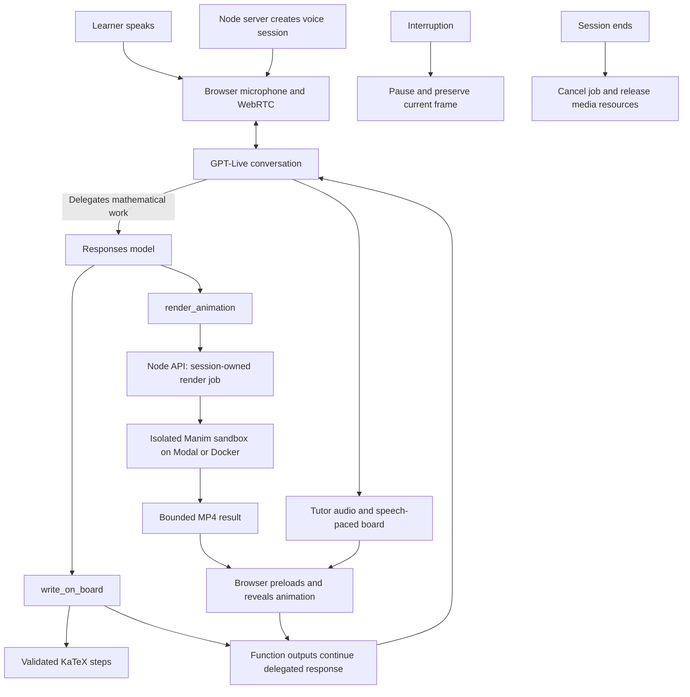

# Manim Educator

Learn mathematics through conversation, written steps, and animations that bring the explanation to life.

Start with an empty board, choose what you want to learn, and talk to the tutor. Ask a follow-up or interrupt to explore an idea further.

[Try Manim Educator](https://manim-educator.netlify.app)

## Run

```sh
npm start
```

Open [http://localhost:4174](http://localhost:4174) and allow microphone access.

### First-time setup

Use Node.js 22.6 or newer and a current Chrome browser. Install dependencies with `npm ci`, then create a `.env` file in the project root:

```dotenv
OPENAI_API_KEY=your_openai_api_key
RENDER_PROVIDER=modal
MODAL_TOKEN_ID=your_modal_token_id
MODAL_TOKEN_SECRET=your_modal_token_secret
```

Prepare the Manim image on Modal once before starting the server:

```sh
npm run prepare:modal
npm start
```

The server loads `.env` automatically. Keep it out of version control. The OpenAI key needs access to the voice and delegated models configured in `server.js`. Voice, generation, and hosted rendering use paid services.

For local rendering with Docker Desktop, set `RENDER_PROVIDER=docker`, start Docker, and run `docker pull manimcommunity/manim:v0.19.0`. Modal credentials are unnecessary with this provider. Without an explicit setting, development defaults to Docker and production defaults to Modal.

## How it works

GPT-Live holds the conversation and decides when to delegate mathematical work. The delegated Responses model writes equations on the board and requests a Manim animation when a graph, diagram, or movement helps explain the idea. A written derivation can stand on its own.

The board reveals steps during tutor speech. While an animation renders, the written explanation stays visible. The browser prepares the video in a second layer, crossfades to its first frame, and starts playback with tutor audio. Interrupting pauses the animation; follow-up questions use the current conversation.



### Voice and delegation

[`server.js`](server.js) creates the voice session, configures its delegation policy, and keeps provider credentials on the server. GPT-Live chooses when to delegate; the application does not infer tool requests from spoken promises.

[`dist/app.js`](dist/app.js) owns the microphone, WebRTC connection, mute/end controls, and orb. The orb reflects measured audio activity. [`dist/animations.js`](dist/animations.js) handles delegated function calls, returns their outputs, and continues the delegated response after its pending tools finish.

### Board and animation contract

[`lib/animation-tool.js`](lib/animation-tool.js) defines two structured tools:

- `write_on_board`: a title and short teaching steps containing plain-text labels and LaTeX equations.
- `render_animation`: a title, narration, and Python source defining a Manim `Explanation(Scene)`.

KaTeX validates equations before replacing the board, with trusted commands disabled. Its assets and fonts are served locally. The first step appears immediately; later steps reveal after each 3.5 seconds of detected tutor speech. This is approximate pacing, not word-level synchronization.

Animations render at 960 × 540 and 24 fps. Playback starts with detected tutor audio, with a four-second fallback if narration is delayed. There are no replay controls or rendering-status overlays. A failed render is returned to the tutor so it can continue the explanation.

### Rendering, isolation, and cleanup

[`lib/render-provider.js`](lib/render-provider.js) selects the renderer. [`lib/modal-renderer.js`](lib/modal-renderer.js) creates a fresh hosted sandbox using the prepared image; [`lib/manim-renderer.js`](lib/manim-renderer.js) supplies the shared Python runner and local Docker implementation.

Generated Python runs without application credentials or network access. Modal sandboxes receive no mounted volumes, public ports, or OIDC identity token. Local Docker additionally uses a read-only root filesystem and bounded temporary storage without host mounts.

| Resource | Limit |
| --- | --- |
| Render attempt | 90 seconds; Manim subprocess limited to 80 seconds |
| CPU / memory | 2 CPUs / 768 MiB |
| Accepted video | 16 MiB |
| Concurrent render jobs | 2 per API process |
| Active sessions | 32 per API process |
| Session lifetime | 1 hour |

[`lib/repair-animation.js`](lib/repair-animation.js) allows one repair attempt when generated code produces render diagnostics. Infrastructure failures do not trigger model repair. Each retry runs in a new isolated environment.

[`lib/animation-jobs.js`](lib/animation-jobs.js) associates jobs with session capability tokens and holds videos in memory. The browser rejects superseded results. Ending a session cancels its job and releases browser media resources; server expiry removes abandoned sessions. Modal sandboxes terminate after success, failure, or cancellation, with the provider lifetime as the final bound if cleanup cannot connect.

## Deployment

Netlify serves the frontend, Railway runs the Node API, and Modal renders animations.

- **Railway:** configure `OPENAI_API_KEY`, `MODAL_TOKEN_ID`, `MODAL_TOKEN_SECRET`, `RENDER_PROVIDER=modal`, and `FRONTEND_ORIGIN` as the exact allowed frontend HTTPS origin or a comma-separated list. Use one API replica while sessions and jobs are stored in memory.
- **Netlify:** set `API_ORIGIN` to the Railway HTTPS origin. `npm run build:frontend` copies `dist` into `build/site` and creates the `/api/*` proxy. Provider credentials belong only on the backend.

Railway deploys from `main`. Netlify currently uses manual CLI deployment:

```sh
npx netlify deploy --build --prod
```

See [`docs/development.md`](docs/development.md) for additional development and deployment details. `dist` contains the checked-in browser assets; `build/site` is the generated Netlify deployment output.

## Verification

```sh
npm run check
npm test
npm run check:modal
```

`check` validates JavaScript syntax. Unit tests cover voice behavior, canvas updates, session/job ownership, rendering cancellation, repair, and mocked Modal execution. They do not establish live provider availability.

`check:modal` makes a real hosted render using the credentials in `.env` and saves `build/modal-check.mp4`. It does not test the voice connection.

Before release, verify the complete browser journey: speak a question, see written working and an animation, interrupt, ask a contextual follow-up, then mute and end the session. `/health` checks API liveness only. Mathematical correctness, delegation choices, and narration timing still need review in the live experience.
